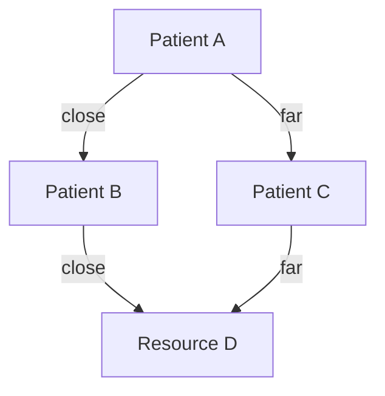
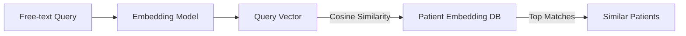
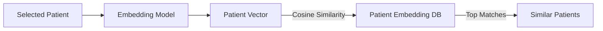
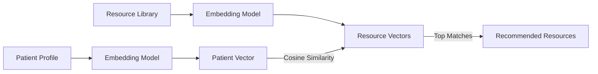
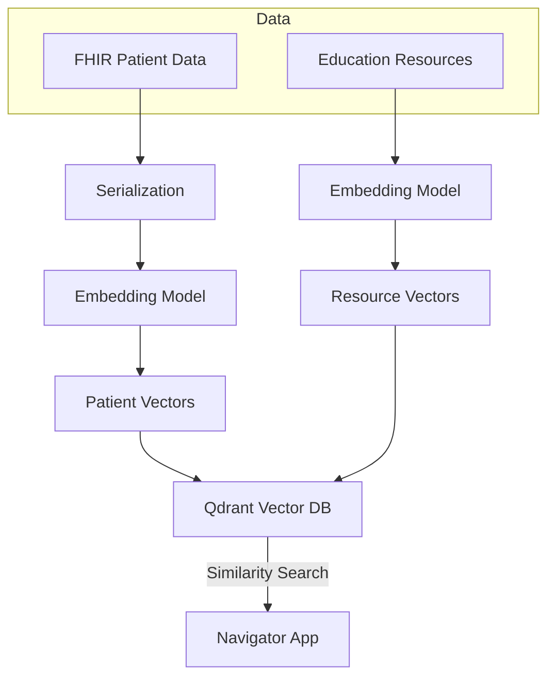

# Giving Patient Care Navigators Superpowers

## Practical Applications of Vector Embeddings to Healthcare

---

## Presentation Outline (45 Minutes)

### 1. Introduction & Motivation (5 min)

- **Script:**
  - "Thank you for joining me today. I want to start with a question: What if every care navigator could instantly find the right patients, resources, and answers—no matter how complex the case?"
  - "Let's think about the daily reality for care navigators. They're expected to personalize care for every patient, but the data is overwhelming—hundreds of conditions, medications, social factors, and more."
  - "Traditional tools are built around checkboxes and codes, but real patient stories are nuanced and complex."
  - "Today, I'll show you how vector embeddings—an AI technique that's transforming search and recommendations in tech—can give care navigators superpowers."
  - "We'll see how these tools can:
    - Enable natural language search for similar patients
    - Instantly find 'patients like mine'
    - Recommend the most relevant educational materials for each patient
    - And ultimately, help navigators deliver more personalized, effective care."
  - "By the end, I hope you'll see how these techniques can make a real difference for both navigators and patients."

#### **Diagram: Embedding Space (Vector Similarity)**

_Caption: Patients and resources are mapped into a vector space. Closer points are more similar._

---

### 2. Primer: What Are Vector Embeddings? (5 min)

- **Script:**
  - "Let's break down what embeddings are. Imagine a map where every patient and every resource is a point. The closer two points are, the more similar they are."
  - "Embeddings turn complex data—like a patient's medical history—into a set of numbers that capture meaning."
  - "Think of it like this: If you've ever used Google Photos to search for 'beach' and it finds all your beach pictures, even if you never labeled them, that's embeddings at work."
  - "In healthcare, we can use embeddings to represent not just words, but entire patient profiles, clinical notes, or educational resources."
  - "[Show a visual: clusters of similar patients using t-SNE or UMAP.]"
  - "This lets us do things like semantic search and recommendations, going far beyond simple keyword matching."
  - "Why is this powerful? Because it means we can match on meaning, not just exact words or codes."
  - "Any questions so far about what embeddings are or why they matter?"

#### **Diagram: Query to Similar Patients Workflow**

_Caption: A free-text query is embedded and compared to patient vectors to find similar patients._

---

### 3. Use Case 1: Natural Language Search for Similar Patients (10 min)

- **Script:**
  - "Let's dive into our first use case: natural language search for similar patients."
  - "Imagine you're a care navigator and you have a new patient: a 55-year-old woman with hypertension and kidney disease. You want to find other patients with similar profiles to learn from their journeys."
  - "With traditional systems, you'd have to search by diagnosis codes, maybe filter by age, and hope you catch all the relevant cases. But what if the notes say 'high blood pressure' instead of 'hypertension'? Or what if the patient's story is more complex?"
  - "With embeddings, you can simply type a free-text query—just like you'd describe the patient to a colleague. The system embeds your query and finds the most semantically similar patients, even if the words or codes don't match exactly."
  - "Let's see this in action: [Demo entering a query and reviewing results. Show how the top results share key features with the query, even if the language is different.]"
  - "Notice how the system understands the meaning, not just the words. This is powerful for onboarding new navigators, supporting research, and planning care for complex cases."
  - "You can also use this for cohort discovery—finding groups of patients for outreach, research, or support programs."
  - "What kinds of queries do you think would be most useful in your work? [Pause for audience input.]"

#### **Diagram: Patient-to-Patient Similarity**

_Caption: A selected patient's embedding is compared to all others to find similar patients._

---

### 4. Use Case 2: Finding Patients Similar to a Known Patient (10 min)

- **Script:**
  - "Our second use case is about finding 'patients like mine.' This is a common need for navigators—maybe you want to connect a patient with a peer, or you want to learn from similar cases to anticipate challenges."
  - "With embeddings, you can select any patient in the system and instantly see a ranked list of similar patients. The system compares the selected patient's embedding to all others and returns those that are closest in the vector space."
  - "Let's walk through this: [Demo: Select a patient, click 'Find Similar Patients', and review the list. Point out shared conditions, demographics, or social factors.]"
  - "This isn't just about matching on diagnosis codes. The system can pick up on patterns in the full patient history—medications, procedures, even social determinants if they're included."
  - "This helps navigators:
    - Learn from past cases
    - Build support groups or peer connections
    - Plan proactive interventions for at-risk patients
      "
  - "For example, if you have a patient struggling with medication adherence, you can find others who faced similar challenges and see what worked for them."
  - "How might this change the way you approach care planning or patient support? [Pause for discussion.]"

#### **Diagram: Patient-to-Resource Recommendation**

_Caption: Patient and resource embeddings are compared to recommend the most relevant materials._

---

### 5. Use Case 3: Recommending Appropriate Educational Materials (10 min)

- **Script:**
  - "Our third use case is about personalized patient education. We know that education is key to engagement and outcomes, but finding the right materials for each patient can be time-consuming."
  - "With embeddings, we can represent both patient profiles and educational resources in the same vector space. For any patient, the system recommends the most relevant articles, videos, or support groups based on semantic similarity."
  - "Let's see how this works: [Demo: Select a patient, click 'Recommended Education', and show the personalized list. Point out how the recommendations match the patient's conditions, language, or concerns.]"
  - "This approach means:
    - Navigators spend less time searching for materials
    - Patients get information that's truly relevant to them
    - We can support health literacy and self-management at scale
      "
  - "You can even filter resources by language, age, or other factors to make the recommendations even more personalized."
  - "Imagine a patient newly diagnosed with diabetes and hypertension. Instead of generic handouts, they get targeted resources on managing both conditions, lifestyle changes, and local support groups."
  - "What kinds of educational resources do you wish you had at your fingertips for your patients? [Pause for audience input.]"

---

### 6. Implementation & Technical Deep Dive (5 min)

- **Script:**
  - "Let's take a look under the hood at how all this works."
  - "We start with FHIR data—an industry standard for healthcare information. We serialize each patient's history into a format that captures their story."
  - "We use state-of-the-art models, like OpenAI or HuggingFace, to generate embeddings for both patients and resources. These embeddings are high-dimensional vectors that capture the meaning of the data."
  - "We store these vectors in a vector database, like Qdrant, which is optimized for fast similarity search."
  - "When a navigator enters a query or selects a patient, the system embeds the input and searches for the closest matches in real time."
  - "This approach is scalable—we can handle thousands or millions of patients and resources."
  - "Privacy is a top concern. We never expose raw patient data—only the embeddings, which are not directly human-readable."
  - "We can also extend this approach to include social determinants, behavioral health, or even genomic data in the future."
  - "Any questions about the technical side? I'm happy to dive deeper into any part."

#### **Diagram: System Architecture**

_Caption: FHIR data and resources are embedded, stored in a vector DB, and searched in real time by the navigator app._

---

### 7. Q&A, Discussion, and Future Directions (5 min)

- **Script:**
  - "I'd love to hear your questions, ideas, or concerns. What else could we do with this approach?"
  - "Some future directions we're exploring include:
    - Predictive analytics—using embeddings as features in risk models
    - Integrating social determinants and behavioral health data
    - Making these tools available not just to navigators, but to clinicians and patients themselves
    - Improving explainability—helping users understand why certain matches or recommendations are made
      "
  - "Thank you for your attention and engagement. I hope you're as excited as I am about the potential of these tools to empower care navigators and improve patient outcomes."
  - "Let's discuss!"

---

## Optional: Slide/Section Breakdown

| Section                              | Time   | Slide/Content Ideas                |
| ------------------------------------ | ------ | ---------------------------------- |
| Introduction & Motivation            | 5 min  | Problem, vision, why embeddings    |
| Embeddings Primer                    | 5 min  | Visuals, simple analogies          |
| Use Case 1: NL Search                | 10 min | Demo, workflow, impact             |
| Use Case 2: Similar Patient          | 10 min | Demo, workflow, impact             |
| Use Case 3: Education Recommendation | 10 min | Demo, workflow, impact             |
| Technical Deep Dive                  | 5 min  | Architecture, privacy, scalability |
| Q&A / Future                         | 5 min  | Discussion, next steps             |
